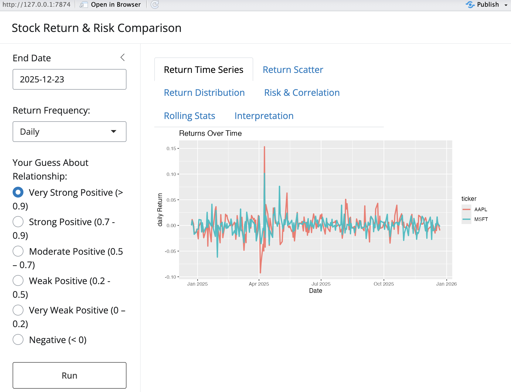
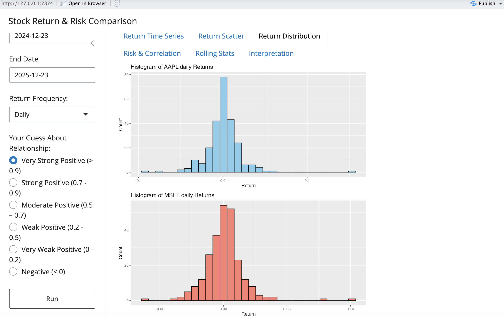

# Stock Return & Risk Analysis

## Overview
This project develops an **interactive R Shiny application** for comparing the return and risk profiles of two stocks.  
Users can select tickers, date ranges, return frequency, and explore returns, histograms, risk metrics, and rolling statistics.  

This project demonstrates **quantitative finance skills**, **risk-return analysis**, and **interactive data visualization**, making it suitable for a professional portfolio or MFE applications.

---

## Features
- **Return Time Series:** Plot of returns over time for selected stocks  
- **Return Scatter Plot:** Scatter plot showing co-movement of returns  
- **Return Distributions:** Histograms of returns for visualizing risk  
- **Risk Metrics:** Sharpe ratio, max drawdown  
- **Rolling Statistics:** 20-day rolling volatility and correlation  
- **Interpretation:** Text analysis highlighting key insights  

---

## Installation
This project requires the following R packages. You can also see the installation code in [Click here to open the interactive rmd file](stock_return_risk_analysis.rmd):

```r
install.packages(c("shiny", "bslib", "quantmod", "ggplot2", "TTR"))
```

---

## How to Run
1. Open [Click here to open the interactive rmd file](stock_return_risk_analysis.rmd) in RStudio.
2. Run the first chunk to install packages only if not installed already.
3. Run the second chunk to launch the Shiny App.
The app will appear in your RStudio Viewer or default web browser for interactive exploration. 

---

## Screenshots of the Shiny App


*Return Time Series Plot*


*Return Histograms*